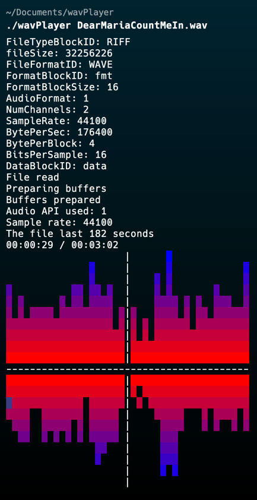

# WavPlayer

A simple wav file player made from almost nothing. Parsing the file and separating samples into buffers is done without libraries. The sound broadcast in an output stream is done thanks to the library RtAudio which is used for the strict minimum. The parameters of the output stream come from the parser information of the file. The aim of this project is to learn the structure of an audio file and how to exploit the information without assistance, as well as to study audio programming in a non-realtime context.

## Installation

### Clone the repository

```bash
git clone git@github.com:TalleuxEwen/wavPlayer.git
```

### Build the project

```bash
./build.sh
```

## Usage

```bash
./wavPlayer [file.wav]
```

## Screenshot



## Author

[👤 **Ewen Talleux**](https://github.com/TalleuxEwen)

